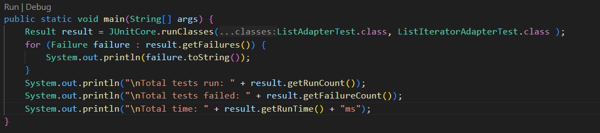

# ListAdapter

## Descrizione

Questo progetto implementa un adapter per l'interfaccia `List` della versione Java 2 Platform partendo da CLDC 1.1 utilizzando la classe `Vector`. Il progetto include anche una suite di test unitari sviluppata con metodologia Test Driven Development (TDD).

(Sviluppato con JDK 22.0.1)

## Struttura del Progetto

- `src/`: Codice sorgente del progetto.
  - `myAdapter/`: Implementazioni delle interfacce e delle classi dell'adapter.
  - `myTest/`: Test unitari per le classi dell'adapter.
- `lib/`: Librerie esterne (ad esempio, `junit.jar`).
- `javadoc/`: Documentazione generata.
  - `adapter/`: Documentazione Javadoc per le classi dell'adapter.
  - `tests/`: Documentazione dei test case.
- `README.md`: Documentazione del progetto.

## Funzionalità Principali

Il progetto `ListAdapter` implementa tutte le funzionalità dell'interfaccia `List` di Java 2 Platform utilizzando `Vector` di CLDC 1.1. Tra le principali operazioni supportate:

- Aggiunta, rimozione e modifica di elementi nella lista
- Iterazione degli elementi
- Gestione delle eccezioni previste dall'interfaccia `List`

## Metodologia TDD

In questo progetto, è stata utilizzata la metodologia Test Driven Development (TDD). Ogni metodo creato e implementato è stato immediatamente testato prima di passare al successivo. Ogni metodo delle classi è testato per il corretto funzionamento e il lancio di eccezioni, garantendo un codice prevedibile in qualsiasi condizione.

## Compatibilità

Il progetto è compatibile con JDK 1.4.2 e versioni superiori. È possibile che utilizzando versioni successive vengano visualizzati avvisi di operazioni non sicure:
- `Note: src/myAdapter/ListAdapter.java uses unchecked or unsafe operations.`
- `Note: Recompile with -Xlint:unchecked for details.`

## Struttura dei Test

I test sono raggruppati nella cartella `myTest` e organizzati in tre file:
- `TestRunner.java`: Contiene la suite dei test per eseguire tutti i test.
- `ListAdapterTest.java`: Contiene tutti i test della classe che implementa l'interfaccia `HList`.
- `ListIteratorAdapterTest.java`: Contiene tutti i test della classe che implementa l'interfaccia `HListIterator`.

## Creazione della Documentazione Javadoc

Per generare la documentazione Javadoc, eseguire il seguente comando:

```sh
javadoc -d javadoc -sourcepath src -subpackages myAdapter -classpath lib/junit-4.13.2.jar:lib/hamcrest-core-1.3.jar
```

## Compilazione ed Esecuzione

### Prerequisiti

- JDK 1.4.2 (o compatibile con CLDC 1.1)
- JUnit (incluso nella cartella `lib`)
- hamcrest-core-1.3.jar (incluso nella cartella `lib`)

### Compilare il Progetto

Per compilare il progetto, eseguire il seguente comando:

```sh
javac -cp lib/junit-4.13.2.jar:lib/hamcrest-core-1.3.jar -d bin src/myAdapter/*.java src/myTest/*.java
```

### Eseguire il Progetto

Per eseguire il progetto, eseguire il seguente comando:

```sh
java -cp bin:lib/junit-4.13.2.jar:lib/hamcrest-core-1.3.jar myTest.TestRunner
```

In alternativa, puoi usare il file `run_tests.sh`. Per rendere eseguibile lo script, esegui il seguente comando nella directory principale del progetto:

```sh
chmod +x run_tests.sh
```

Dopo aver reso eseguibile lo script, puoi eseguirlo direttamente dal terminale utilizzando il comando:

```sh
./run_tests.sh
```

## Contributi

Siamo aperti ai contributi! Per favore, segui queste linee guida per contribuire al progetto:

1. **Fork il progetto**.
2. **Crea un branch per la tua feature** (`git checkout -b feature/AmazingFeature`).
3. **Commit i tuoi cambiamenti** (`git commit -m 'Add some AmazingFeature'`).
4. **Push il branch** (`git push origin feature/AmazingFeature`).
5. **Apri una pull request**.

## Licenza

Questo progetto non specifica una licenza. Ti consigliamo di aggiungere un file `LICENSE` per chiarire i termini di utilizzo del codice.

## Esempi di Output e Screenshot

(Includere esempi di output dei test e screenshot della documentazione Javadoc generata).

